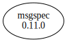

# Third Party Dependencies

<!--[[[fill sbom_sha256()]]]-->
The [SBOM in CycloneDX v1.4 JSON format](https://git.sr.ht/~sthagen/vitriini/blob/default/sbom.json) with SHA256 checksum ([8c34c442 ...](https://git.sr.ht/~sthagen/vitriini/blob/default/sbom.json.sha256 "sha256:8c34c44295aa1ed721fed9c885b42cda0fffb2ca4563f799651d4b65c48bbb35")).
<!--[[[end]]] (checksum: a91f26bb135486792dccc87d7af7b4b6)-->
## Licenses 

JSON files with complete license info of: [direct dependencies](direct-dependency-licenses.json) | [all dependencies](all-dependency-licenses.json)

### Direct Dependencies

<!--[[[fill direct_dependencies_table()]]]-->
| Name                                        | Version                                            | License     | Author          | Description (from packaging data)                                             |
|:--------------------------------------------|:---------------------------------------------------|:------------|:----------------|:------------------------------------------------------------------------------|
| [msgspec](https://jcristharif.com/msgspec/) | [0.11.0](https://pypi.org/project/msgspec/0.11.0/) | BSD License | Jim Crist-Harif | A fast and friendly JSON/MessagePack library, with optional schema validation |
<!--[[[end]]] (checksum: 49c1e2a8d327cebe466d7ffb04ebc834)-->

### Indirect Dependencies

<!--[[[fill indirect_dependencies_table()]]]-->
| Name | Version | License | Author | Description (from packaging data) |
|:-----|:--------|:--------|:-------|:----------------------------------|
<!--[[[end]]] (checksum: 8a87b89207db0be2864af66f9266660c)-->

## Dependency Tree(s)

JSON file with the complete package dependency tree info of: [the full dependency tree](package-dependency-tree.json)

### Rendered SVG

Base graphviz file in dot format: [Trees of the direct dependencies](package-dependency-tree.dot.txt)



### Console Representation

<!--[[[fill dependency_tree_console_text()]]]-->
````console
msgspec==0.11.0
````
<!--[[[end]]] (checksum: 8b0d7c6a87e92b6edeaef656c879786a)-->
